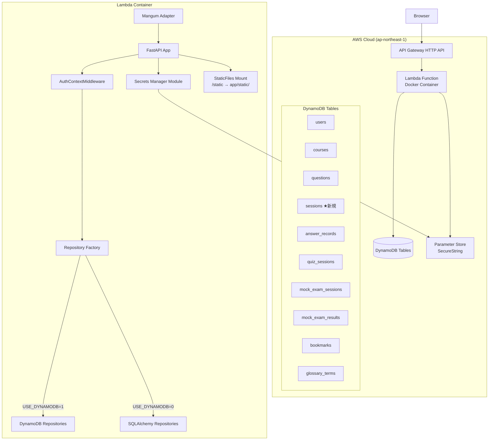
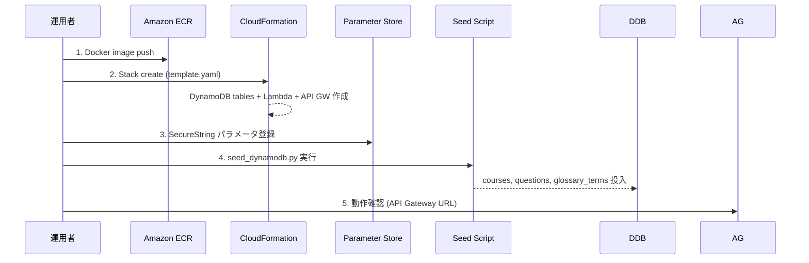

# Design Document: AWS DynamoDB Deployment

## Overview

本設計は「愛媛探索AIクイズ」FastAPIアプリケーションのAWS本番デプロイを完了するための技術設計書である。既存のDynamoDBリポジトリ層、SAMテンプレート、Dockerfileを基盤として、以下の未完了項目を実装する：

1. **Sessions テーブルの CloudFormation 定義** — 認証セッション永続化用DynamoDBテーブルの追加
2. **認証ミドルウェアの DynamoDB 対応** — `AuthContextMiddleware` のデュアルバックエンド対応
3. **シークレット管理** — AWS Systems Manager Parameter Store による Gemini API キーの安全な取得・キャッシュ
4. **DynamoDB 初期データ投入スクリプト** — バッチ書き込み・リトライ機構を備えたシードスクリプト
5. **Lambda 実行環境の完全性** — 全ルート動作・エラーハンドリング・環境分岐の確認
6. **手動デプロイ手順書** — AWSコンソール経由のステップバイステップガイド
7. **静的ファイル配信の Lambda 対応** — CSS/JS/SVG/audio の正しいContent-Type配信

### 設計方針

- 既存の `repository_factory.py` パターン（`USE_DYNAMODB` 環境変数による分岐）を踏襲する
- DynamoDB アクセスは既存の `app/data/dynamodb.py` ヘルパー関数を最大限活用する
- Lambda コールドスタート時間を最小化するため、シークレットはインメモリキャッシュする
- SAMテンプレートは既存リソース定義と一貫したスタイル（PAY_PER_REQUEST、Project タグ）を維持する

## Architecture



### デプロイフロー



## Components and Interfaces

### 1. SessionsTable CloudFormation リソース

**場所:** `deploy/template.yaml`

SAMテンプレートの DynamoDB Tables セクションに `SessionsTable` リソースを追加する。既存テーブル定義（`UsersTable`, `CoursesTable` 等）と同じスタイルを踏襲する。

```yaml
SessionsTable:
  Type: AWS::DynamoDB::Table
  Properties:
    TableName: EhimeAI2026-sessions
    BillingMode: PAY_PER_REQUEST
    AttributeDefinitions:
      - AttributeName: token
        AttributeType: S
    KeySchema:
      - AttributeName: token
        KeyType: HASH
    TimeToLiveSpecification:
      AttributeName: expires_at
      Enabled: true
    Tags:
      - Key: Project
        Value: EhimeAI2026
```

**設計判断:** パーティションキーを `token` にする理由は、セッション検索が常にトークン値によるルックアップであるため。`id` ではなく `token` を PK にすることで、既存の `DynamoDBAuthSessionStore` の `get_item("sessions", {"token": session_token})` 呼び出しと整合する。

### 2. AuthContextMiddleware の DynamoDB 対応

**場所:** `main.py` の `AuthContextMiddleware` クラス

現在の実装は SQLAlchemy の `SessionLocal` と `UserModel` に直接依存している。これを `repository_factory.get_user_repository()` 経由に変更し、`USE_DYNAMODB` 環境変数に基づき自動的にバックエンドを切り替える。

```python
class AuthContextMiddleware(BaseHTTPMiddleware):
    async def dispatch(self, request, call_next):
        token = request.cookies.get("session_token")
        user_id = AuthService.get_user_id_from_session(token)

        request.state.current_user_name = None

        if user_id:
            try:
                user_repo = get_user_repository()
                user = user_repo.get_by_id(user_id)
                if user:
                    request.state.current_user_name = user["display_name"]
            except Exception:
                pass

        response = await call_next(request)
        return response
```

**設計判断:** `repository_factory` パターンを使用することで、ミドルウェア自体は `USE_DYNAMODB` の値を意識する必要がなくなる。テスト時にリポジトリをモックすることも容易になる。

### 3. シークレット管理モジュール

**場所:** 新規ファイル `app/data/secrets.py`

```python
"""
Secrets management via AWS Systems Manager Parameter Store.

Lambda cold start 時に一度だけ Parameter Store からシークレットを取得し、
インメモリにキャッシュする。
"""

import os
import logging
import boto3
from botocore.config import Config
from typing import Optional

logger = logging.getLogger(__name__)

_secrets_cache: dict[str, str] = {}

SSM_TIMEOUT = 5  # seconds

def _get_environment() -> str:
    """ENVIRONMENT 環境変数を検証して返す。"""
    env = os.environ.get("ENVIRONMENT", "")
    if env not in ("prod", "staging"):
        raise RuntimeError(
            f"Invalid ENVIRONMENT: '{env}'. Must be 'prod' or 'staging'."
        )
    return env

def get_secret(param_name: str) -> Optional[str]:
    """Parameter Store からシークレットを取得する（キャッシュ付き）。"""
    if param_name in _secrets_cache:
        return _secrets_cache[param_name]

    environment = _get_environment()
    param_path = f"/EhimeAI2026/{environment}/{param_name}"

    try:
        config = Config(connect_timeout=SSM_TIMEOUT, read_timeout=SSM_TIMEOUT)
        ssm = boto3.client("ssm", config=config)
        response = ssm.get_parameter(Name=param_path, WithDecryption=True)
        value = response["Parameter"]["Value"]
        _secrets_cache[param_name] = value
        return value
    except Exception as e:
        logger.error("Parameter Store retrieval failed for %s: %s", param_path, type(e).__name__)
        return None
```

**設計判断:**
- タイムアウトを5秒に設定し、Lambda の30秒制限内で確実に失敗を検知する
- エラーログにはパラメータパスのみ記録し、シークレット値は絶対に含めない
- キャッシュはモジュールレベル辞書で実装（Lambda 実行環境のライフタイム = プロセスのライフタイム）

### 4. Parameter Store IAM ポリシー

**場所:** `deploy/template.yaml` の `EhimeAI2026LambdaExecutionRole`

```yaml
- PolicyName: EhimeAI2026-ssm-access
  PolicyDocument:
    Version: '2012-10-17'
    Statement:
      - Effect: Allow
        Action:
          - ssm:GetParameter
        Resource:
          - !Sub 'arn:aws:ssm:${AWS::Region}:${AWS::AccountId}:parameter/EhimeAI2026/${Environment}/*'
```

### 5. DynamoDB シードスクリプトの改善

**場所:** `scripts/seed_dynamodb.py`

現在の実装は `batch_write_items` ヘルパーを使用しているが、以下の改善が必要：

- **25件バッチ制限の明示的処理**: `batch_writer()` は boto3 が内部で処理するが、低レベル API を使う場合は明示的なチャンク分割が必要
- **UnprocessedItems のリトライ**: 指数バックオフ付き3回リトライ
- **冪等性**: `put_item` の上書きセマンティクスを利用（条件なし put）
- **テーブルアクセスエラーのハンドリング**: `ResourceNotFoundException` 等を捕捉して早期終了
- **完了時の件数レポート**

```python
def batch_write_with_retry(table_name: str, items: list[dict], max_retries: int = 3):
    """バッチ書き込み（25件ずつ、リトライ付き）。"""
    client = boto3.client("dynamodb")
    
    for i in range(0, len(items), 25):
        batch = items[i:i+25]
        request_items = {table_name: [{"PutRequest": {"Item": item}} for item in batch]}
        
        retries = 0
        while request_items and retries <= max_retries:
            response = client.batch_write_item(RequestItems=request_items)
            unprocessed = response.get("UnprocessedItems", {})
            if not unprocessed:
                break
            request_items = unprocessed
            retries += 1
            time.sleep(2 ** retries)  # exponential backoff
        
        if request_items:
            raise RuntimeError(f"Failed after {max_retries} retries")
```

**設計判断:** 既存の `batch_write_items` ヘルパー（`boto3.resource` の `batch_writer`）は内部で自動リトライするが、要件の明示的なリトライ制御・件数レポートには低レベル API の方が適している。ただし、既存ヘルパーが `batch_writer` を使っている場合は boto3 が25件制限とリトライを内部処理するため、`batch_writer` の利用を継続しつつ、完了件数カウントとエラーハンドリングを追加する方針とする。

### 6. Lambda 実行環境の完全性

**場所:** `main.py`

- **Mangum アダプター**: 既に実装済み (`handler = Mangum(app)`)
- **汎用例外ハンドラー**: 現在コメントアウトされている `unhandled_exception_handler` を有効化し、500 エラーページを返すようにする
- **SQLite 初期化スキップ**: 既に `lifespan` 関数内で実装済み

```python
@app.exception_handler(Exception)
async def unhandled_exception_handler(request: Request, exc: Exception) -> HTMLResponse:
    """未処理の例外をキャッチしてエラーページを返す。"""
    logger.error("未処理の例外: %s: %s", type(exc).__name__, str(exc))
    return templates.TemplateResponse(
        request,
        "error.html",
        context={
            "error_title": "エラー (500)",
            "error_message": "サーバー内部でエラーが発生しました。しばらくしてからお試しください。",
            "retry_url": None,
        },
        status_code=500,
    )
```

### 7. 静的ファイル配信

**場所:** `main.py` および `Dockerfile`

- **FastAPI StaticFiles**: 既に `app.mount("/static", StaticFiles(directory="app/static"), name="static")` で実装済み
- **Dockerfile**: 既に `COPY app/ ${LAMBDA_TASK_ROOT}/app/` で `app/static/` を含むディレクトリ全体をコピーしている
- **Content-Type**: FastAPI の `StaticFiles` は `mimetypes` モジュールを使用してファイル拡張子から自動的に Content-Type を判定する。標準の MIME タイプマッピング (`.css` → `text/css`, `.js` → `application/javascript`, `.svg` → `image/svg+xml`, `.mp3` → `audio/mpeg`) が適用される

**確認事項:** Lambda のファイルシステムは読み取り専用だが、`StaticFiles` はファイルの読み取りのみを行うため問題ない。

### 8. デプロイ手順書

**場所:** `deploy/MANUAL_DEPLOY.md`

マークダウン形式で以下のセクションを含む手順書を作成する：

1. ECR リポジトリ作成と Docker イメージプッシュ
2. CloudFormation スタック作成
3. Parameter Store シークレット登録
4. DynamoDB シードデータ投入
5. 動作確認
6. トラブルシューティング

## Data Models

### Sessions テーブル

| 属性名 | 型 | 説明 |
|--------|------|------|
| `token` (PK) | String | セッショントークン (secrets.token_urlsafe(32)) |
| `user_id` | String | ユーザーID (UUID) |
| `created_at` | String | 作成日時 (ISO 8601) |
| `expires_at` | Number | 有効期限 (Unix epoch, TTL属性) |

**TTL 動作:** DynamoDB は `expires_at` が現在時刻を過ぎたアイテムを自動的に削除する（通常48時間以内）。`DynamoDBAuthSessionStore.get_user_id()` は TTL 削除を待たずにアイテムの存在のみを確認する設計だが、DynamoDB TTL は「期限切れ保証」ではなく「ベストエフォート削除」であるため、アプリケーション側で `expires_at` チェックを追加することも検討に値する。現行実装では DynamoDB の TTL に委ねる方針とする。

### Parameter Store パラメータ

| パス | 型 | 説明 |
|------|------|------|
| `/EhimeAI2026/prod/GEMINI_API_KEY` | SecureString | Gemini API キー (本番) |
| `/EhimeAI2026/staging/GEMINI_API_KEY` | SecureString | Gemini API キー (ステージング) |

### シードデータ構造

| テーブル | データソース | キーフィールド | 概算件数 |
|----------|------------|--------------|---------|
| courses | `COURSES` (seed_data.py) | `id` | ~20 |
| questions | `QUESTIONS` + `EXTRA_QUESTIONS` + `EXTRA_QUESTIONS_2` | `id` | ~200+ |
| glossary_terms | `GLOSSARY_SEED_DATA` (glossary_seed.py) | `id` (UUID生成) | ~50+ |

## Correctness Properties

*A property is a characteristic or behavior that should hold true across all valid executions of a system—essentially, a formal statement about what the system should do. Properties serve as the bridge between human-readable specifications and machine-verifiable correctness guarantees.*

### Property 1: Auth middleware resolves valid session to correct display_name

*For any* valid session token that exists in the sessions store and maps to a user_id with a corresponding user record containing a display_name, the AuthContextMiddleware SHALL set `request.state.current_user_name` to that user's display_name.

**Validates: Requirements 2.1, 2.3**

### Property 2: Auth middleware sets None for invalid session states

*For any* request where the session_token cookie is missing, or the token does not exist in the sessions store, or the token maps to a user_id without a corresponding user record, the AuthContextMiddleware SHALL set `request.state.current_user_name` to None without interrupting request processing.

**Validates: Requirements 2.4, 2.5, 2.6**

### Property 3: Batch write sizing invariant

*For any* list of seed data items of arbitrary length, the batch write function SHALL partition the items into groups of at most 25 items per DynamoDB batch_write_item request.

**Validates: Requirements 4.4**

### Property 4: Seed script idempotence

*For any* set of seed data items, executing the seed script twice in succession SHALL produce the same final DynamoDB table state as executing it once (no duplicate records, all items present with their latest values).

**Validates: Requirements 4.6**

### Property 5: Unhandled exceptions produce HTML error page

*For any* registered application route, if an unhandled exception occurs during request processing, the Lambda function SHALL return an HTML response with HTTP status code 500 containing an error page, never exposing raw stack traces to the client.

**Validates: Requirements 5.6**

### Property 6: Static file Content-Type correctness

*For any* static file request where the file exists in `app/static/`, the application SHALL return a Content-Type header that matches the file extension mapping: `.css` → `text/css`, `.js` → `application/javascript`, `.svg` → `image/svg+xml`, `.mp3` → `audio/mpeg`.

**Validates: Requirements 7.2**

### Property 7: Non-existent static file returns 404

*For any* request path under `/static/` that does not correspond to an existing file in the `app/static/` directory, the application SHALL return HTTP status code 404.

**Validates: Requirements 7.3**

## Error Handling

### シークレット取得失敗

| 障害パターン | 検知方法 | 対応 |
|-------------|---------|------|
| Parameter Store タイムアウト (>5s) | `botocore.exceptions.ConnectTimeoutError` / `ReadTimeoutError` | エラーログ出力、AI機能を「一時的に利用不可」として応答 |
| 権限不足 | `botocore.exceptions.ClientError` (AccessDeniedException) | エラーログ出力、AI機能を「一時的に利用不可」として応答 |
| パラメータ未登録 | `botocore.exceptions.ClientError` (ParameterNotFound) | エラーログ出力、AI機能を「一時的に利用不可」として応答 |
| ENVIRONMENT 未設定/不正値 | `RuntimeError` at startup | 初期化失敗、Lambda がコールドスタートエラー |

### 認証ミドルウェアエラー

| 障害パターン | 検知方法 | 対応 |
|-------------|---------|------|
| DynamoDB 接続エラー | `botocore.exceptions.ClientError` | `current_user_name = None`、リクエスト処理続行 |
| ユーザーレコード不在 | `get_by_id()` returns None | `current_user_name = None` |
| 予期しない例外 | `except Exception` | `current_user_name = None`、リクエスト処理続行 |

### シードスクリプトエラー

| 障害パターン | 検知方法 | 対応 |
|-------------|---------|------|
| テーブル不在 | `ResourceNotFoundException` | エラーメッセージ出力、exit(1)、後続テーブル処理なし |
| UnprocessedItems 3回リトライ超過 | リトライカウンタ | エラーメッセージ出力、exit(1) |
| 接続エラー | `EndpointConnectionError` | エラーメッセージ出力、exit(1) |

### Lambda 実行時エラー

| 障害パターン | 検知方法 | 対応 |
|-------------|---------|------|
| 未処理例外 | `@app.exception_handler(Exception)` | HTML 500 エラーページ返却 |
| タイムアウト (30s) | API Gateway 設定 | HTTP 503 自動応答 |
| メモリ不足 | Lambda OOM | Lambda 再試行 or 502 |

## Testing Strategy

### テストフレームワーク

- **pytest** — テスト実行
- **hypothesis** — プロパティベーステスト（既にプロジェクトで使用中）
- **moto** — AWS サービスモック（DynamoDB, SSM）
- **httpx** — FastAPI TestClient 経由の HTTP テスト

### プロパティベーステスト

プロパティベーステストは以下の対象に適用する。各プロパティテストは最低100イテレーションを実行する。

| Property | テスト対象 | Hypothesis 戦略 |
|----------|-----------|----------------|
| Property 1 | AuthContextMiddleware (valid session) | `st.text()` for tokens, `st.text()` for display_names |
| Property 2 | AuthContextMiddleware (invalid states) | `st.none()` \| `st.text()` for tokens, missing user records |
| Property 3 | Batch write sizing | `st.lists(st.dictionaries(...), min_size=0, max_size=500)` |
| Property 4 | Seed script idempotence | `st.lists(st.fixed_dictionaries({...}))` |
| Property 5 | Unhandled exception handler | 各ルートに対してランダム例外を注入 |
| Property 6 | Static file Content-Type | `st.sampled_from([".css", ".js", ".svg", ".mp3"])` |
| Property 7 | Non-existent static paths | `st.text(alphabet=st.characters(whitelist_categories=("L", "N")))` |

各テストには以下のフォーマットでタグコメントを付与する：
```python
# Feature: aws-dynamodb-deployment, Property 1: Auth middleware resolves valid session to correct display_name
```

### ユニットテスト（例示ベース）

| 対象 | テスト内容 |
|------|-----------|
| SAM テンプレート構造 | SessionsTable リソース定義の検証 (YAML パース) |
| シークレット取得 | SSM モック経由のパラメータ取得成功・失敗テスト |
| シークレットキャッシュ | 2回呼び出しで SSM 呼び出し1回のみ検証 |
| ENVIRONMENT バリデーション | 不正値での初期化失敗テスト |
| シードスクリプト | moto DynamoDB でのデータ投入・件数レポート検証 |
| Mangum handler | `main.handler` が Mangum インスタンスであることの検証 |
| Lifespan (DynamoDB mode) | USE_DYNAMODB=1 で SQLite 初期化スキップの検証 |

### インテグレーションテスト

| 対象 | テスト内容 |
|------|-----------|
| 全ルート応答 | TestClient で各登録ルートに GET リクエスト、2xx/3xx 確認 |
| 静的ファイル配信 | 既知の CSS/JS ファイルの配信確認 |
| DynamoDB セッションフロー | moto DynamoDB でのログイン → セッション取得 → ユーザー名表示フロー |

### テストにおけるPBT非適用領域

以下はプロパティベーステストの対象外とし、スモークテストまたは例示テストで検証する：

- **CloudFormation テンプレート構造** (IaC) — YAML パースによるアサーション
- **Dockerfile 内容** — ファイル内容のアサーション
- **デプロイ手順書** — ファイル存在とセクション構成の検証
- **IAM ポリシー定義** — テンプレートパースによるアサーション
