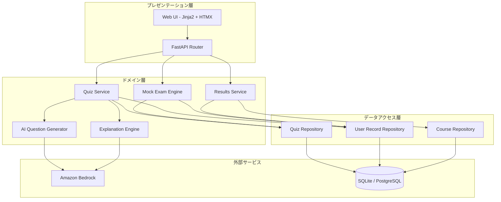
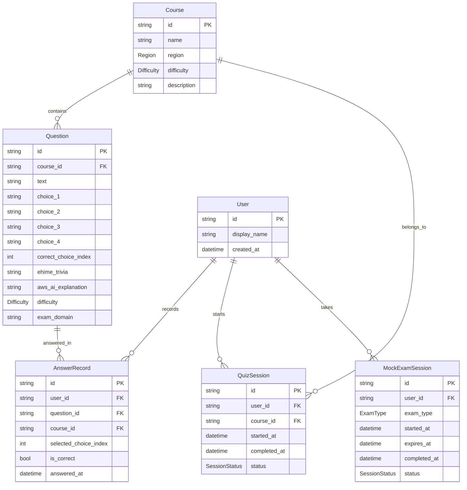

# Design Document: 愛媛探索AIクイズ (Ehime Exploration AI Quiz)

## Overview

愛媛探索AIクイズは、愛媛県の大学生・高専生向けの学習プラットフォームである。Pythonをバックエンドに、愛媛の地域テーマ（観光・名所・郷土料理）とAWS/AIの概念を組み合わせた4択クイズを提供する。

本システムは以下の主要機能を提供する：
- 地域別（中予・南予・東予）・難易度別のコース選択
- 愛媛テーマ × AWS/AI概念の4択クイズ出題
- 回答後の解説表示（愛媛トリビア + AWS/AI概念説明）
- 正答率の記録と成長可視化（レーダーチャート）
- AWS認定資格模擬試験モード（CCP / AI Practitioner）
- AIによる弱点分析とパーソナライズ問題生成

### 技術スタック

- **言語**: Python 3.11+
- **Webフレームワーク**: FastAPI（REST API）
- **フロントエンド**: Jinja2テンプレート + HTMX（軽量SPA風UI）
- **データベース**: SQLite（ローカル開発）/ PostgreSQL（本番想定）
- **ORM**: SQLAlchemy
- **AI連携**: Amazon Bedrock（Claude）を利用したパーソナライズ問題生成
- **チャート描画**: Chart.js（レーダーチャート表示）
- **テスト**: pytest + Hypothesis（プロパティベーステスト）

### 設計方針

1. **シンプルさ優先**: PBL向けプロジェクトとして、学生が理解しやすいアーキテクチャ
2. **レイヤー分離**: ドメインロジック・データアクセス・プレゼンテーションの明確な分離
3. **テスト容易性**: ビジネスロジックを純粋関数として実装し、テスト可能に
4. **段階的拡張**: 最小構成から始め、機能を追加可能な構造

## Architecture



### レイヤー構成

| レイヤー | 責務 | テスト方針 |
|---------|------|-----------|
| プレゼンテーション層 | HTTPリクエスト処理、テンプレート描画 | 統合テスト |
| ドメイン層 | ビジネスロジック、採点、正答率計算 | プロパティベーステスト + ユニットテスト |
| データアクセス層 | データ永続化、クエリ | リポジトリパターンでモック可能 |
| 外部サービス | AI生成、DB接続 | モック利用 |

## Components and Interfaces

### 1. Quiz Service（クイズサービス）

クイズの出題フロー全体を管理するコアサービス。

```python
class QuizService:
    def get_courses(self, region: Optional[Region] = None) -> list[CourseInfo]:
        """地域・難易度別のコース一覧を返す"""
        ...

    def start_course(self, user_id: str, course_id: str) -> QuizSession:
        """コースを開始し、クイズセッションを返す"""
        ...

    def submit_answer(self, session_id: str, question_id: str, choice_index: int) -> AnswerResult:
        """回答を送信し、正誤判定結果を返す"""
        ...

    def get_explanation(self, question_id: str) -> Explanation:
        """問題の解説を取得する"""
        ...

    def complete_course(self, session_id: str) -> CourseSummary:
        """コースを完了し、結果サマリーを返す"""
        ...
```

### 2. Mock Exam Engine（模擬試験エンジン）

タイマー付きの模擬試験を管理する。

```python
class MockExamEngine:
    def start_exam(self, user_id: str, exam_type: ExamType) -> MockExamSession:
        """模擬試験を開始する（65問, 90分）"""
        ...

    def submit_answer(self, session_id: str, question_id: str, choice_index: int) -> None:
        """模擬試験の回答を記録する（即時フィードバックなし）"""
        ...

    def navigate_to_question(self, session_id: str, question_index: int) -> QuestionView:
        """指定の問題に移動する"""
        ...

    def get_remaining_time(self, session_id: str) -> timedelta:
        """残り時間を返す"""
        ...

    def finish_exam(self, session_id: str) -> MockExamResult:
        """試験を終了し、結果を返す"""
        ...
```

### 3. Explanation Engine（解説エンジン）

```python
class ExplanationEngine:
    def generate_explanation(self, question: Question) -> Explanation:
        """AI生成またはプリセット解説を返す（10秒タイムアウト）"""
        ...

    def get_fallback_explanation(self, question: Question) -> Explanation:
        """プリセット解説を返す"""
        ...
```

### 4. AI Question Generator（AI問題生成）

```python
class AIQuestionGenerator:
    def analyze_weak_areas(self, user_id: str) -> list[WeakArea]:
        """ユーザーの誤答パターンから弱点領域を特定する"""
        ...

    def generate_questions(self, weak_areas: list[WeakArea], count_per_area: int) -> list[Question]:
        """弱点領域に基づきパーソナライズ問題を生成する（30秒タイムアウト）"""
        ...
```

### 5. Results Service（結果サービス）

```python
class ResultsService:
    def get_dashboard_data(self, user_id: str) -> DashboardData:
        """ダッシュボードに必要な全データを返す"""
        ...

    def calculate_grade(self, score_percentage: float) -> Grade:
        """スコアからグレードを判定する"""
        ...

    def get_radar_chart_data(self, user_id: str, exam_type: ExamType) -> RadarChartData:
        """レーダーチャート用のドメイン別正答率を返す"""
        ...

    def get_exploration_rate(self, user_id: str) -> ExplorationRate:
        """愛媛探索率を返す"""
        ...
```

### 6. Scoring Module（採点モジュール）

純粋関数として実装し、テスト容易性を確保する。

```python
def calculate_accuracy_rate(correct_count: int, total_count: int) -> float:
    """正答率を計算する（パーセンテージ、小数第1位まで）"""
    ...

def calculate_grade(score_percentage: float) -> Grade:
    """スコアからグレードを判定する"""
    ...

def identify_weak_areas(answer_records: list[AnswerRecord], threshold: float = 0.5) -> list[WeakArea]:
    """誤答率50%以上のドメインを弱点として特定する"""
    ...

def calculate_domain_accuracy(answer_records: list[AnswerRecord]) -> dict[str, float]:
    """ドメイン別の正答率を計算する"""
    ...
```

### 7. Question Validator（問題バリデーター）

```python
def validate_question(question_data: dict) -> ValidationResult:
    """問題データの妥当性を検証する"""
    ...
```

## Data Models



### Enum定義

```python
from enum import Enum

class Region(str, Enum):
    CHUYO = "中予"
    NANYO = "南予"
    TOYO = "東予"

class Difficulty(str, Enum):
    BASIC = "基礎"
    INTERMEDIATE = "中級"
    ADVANCED = "上級"

class ExamType(str, Enum):
    CLOUD_PRACTITIONER = "AWS Certified Cloud Practitioner"
    AI_PRACTITIONER = "AWS AI Practitioner"

class Grade(str, Enum):
    A = "A"  # 90-100%
    B = "B"  # 80-89%
    C = "C"  # 70-79%
    D = "D"  # 60-69%
    E = "E"  # 0-59%

class SessionStatus(str, Enum):
    IN_PROGRESS = "in_progress"
    COMPLETED = "completed"
    EXPIRED = "expired"
```

### グレード判定ロジック

| スコア範囲 | グレード |
|-----------|---------|
| 90–100% | A |
| 80–89% | B |
| 70–79% | C |
| 60–69% | D |
| 0–59% | E |


## Correctness Properties

*A property is a characteristic or behavior that should hold true across all valid executions of a system—essentially, a formal statement about what the system should do. Properties serve as the bridge between human-readable specifications and machine-verifiable correctness guarantees.*

### Property 1: Question validation accepts valid and rejects invalid

*For any* question data, the validation function SHALL accept it if and only if it contains: non-empty question text, exactly 4 non-empty choices, exactly one correct answer index in range [0,3], non-empty Ehime trivia, non-empty AWS/AI explanation, a valid course ID, and a valid difficulty level (基礎, 中級, 上級). Otherwise, it SHALL reject and identify the invalid fields.

**Validates: Requirements 2.1, 5.4, 8.3, 9.1, 9.3, 9.6**

### Property 2: Question data round-trip preservation

*For any* valid question stored in the system, retrieving that question by its ID SHALL return all original fields (text, four choices, correct answer indicator, Ehime trivia, AWS/AI explanation, course, difficulty) with values equal to the original input.

**Validates: Requirements 9.4**

### Property 3: Question ID uniqueness

*For any* set of questions created in the system, all assigned question IDs SHALL be distinct from one another.

**Validates: Requirements 9.5**

### Property 4: Accuracy rate calculation

*For any* non-empty sequence of answer results (correct/incorrect), the calculated accuracy rate SHALL equal `round(correct_count / total_count * 100, 1)`. This SHALL hold both per-course (filtering by course_id) and cumulatively (across all courses), and SHALL include all attempts including repeated answers to the same question.

**Validates: Requirements 4.2, 4.3, 2.5**

### Property 5: Grade assignment from score

*For any* score percentage in range [0, 100], the grade assignment SHALL be: A if score >= 90, B if 80 <= score < 90, C if 70 <= score < 80, D if 60 <= score < 70, E if score < 60. Additionally, for mock exams, unanswered questions SHALL be counted as incorrect in the score calculation.

**Validates: Requirements 5.3, 6.1**

### Property 6: Course grouping by region

*For any* set of courses with assigned regions, the grouping function SHALL place each course into its correct region group (中予, 南予, 東予), and every course SHALL appear in exactly one group.

**Validates: Requirements 1.1**

### Property 7: Domain-level accuracy calculation

*For any* set of answer records with associated exam domain labels, the per-domain accuracy rate for each domain SHALL equal `round(domain_correct / domain_total * 100, 1)` where `domain_correct` and `domain_total` are filtered to only answers for questions in that domain.

**Validates: Requirements 6.2**

### Property 8: Weak area identification

*For any* set of answer records where the user has 10 or more incorrect answers total, a domain SHALL be identified as a weak area if and only if its incorrect rate is 50% or higher (i.e., incorrect_count / total_count >= 0.5 for that domain).

**Validates: Requirements 8.1**

### Property 9: Exploration rate calculation

*For any* set of course completion states and total available courses, the exploration rate SHALL equal `round(completed_courses / total_courses * 100, 1)`, and the region count SHALL equal the number of distinct regions (中予, 南予, 東予) in which at least one course has been completed.

**Validates: Requirements 6.3**

### Property 10: Mock exam remaining time calculation

*For any* mock exam session with a start time and a 90-minute duration, the remaining time at any point SHALL equal `max(0, (start_time + 90 minutes) - current_time)`. When remaining time reaches 0, the exam SHALL be marked as expired.

**Validates: Requirements 5.2**

### Property 11: Answer correctness determination

*For any* question with a defined correct_choice_index and any user-selected choice_index, the answer SHALL be marked correct if and only if selected_choice_index equals correct_choice_index.

**Validates: Requirements 2.3**

### Property 12: Explanation length constraint

*For any* explanation generated or retrieved by the Explanation_Engine, the total character length (Ehime trivia + AWS/AI explanation) SHALL be between 100 and 500 characters inclusive.

**Validates: Requirements 3.3**

### Property 13: Chronological ordering of attempts

*For any* set of quiz or mock exam attempts displayed on the Results_Dashboard, the attempts SHALL be ordered by their timestamp in ascending chronological order.

**Validates: Requirements 6.4**

## Error Handling

### エラーハンドリング方針

| シナリオ | 対処 | ユーザーへの表示 |
|---------|------|----------------|
| 解説生成タイムアウト（10秒） | プリセット解説にフォールバック | シームレスに解説を表示（ユーザーは気づかない） |
| AI問題生成タイムアウト（30秒） | 同じ弱点領域のプリセット問題を出題 | 「問題を準備しています...」→ 問題表示 |
| AI問題生成が不正形式を返却 | バリデーション失敗→プリセット問題 | 同上 |
| 成績記録の保存失敗 | エラーメッセージ表示、リトライ許可 | 「結果の保存に失敗しました。再試行しますか？」 |
| 問題データ不正（選択肢≠4） | 保存時にリジェクト、無効フィールド特定 | 管理者向けエラー表示 |
| 模擬試験中のページ離脱 | 確認ダイアログ表示 | 「進行中の試験があります。離脱すると進捗が失われます。」 |
| データベース接続失敗 | リトライ（最大3回）→ エラー画面 | 「接続エラーが発生しました。しばらくしてからお試しください。」 |

### タイムアウト設定

```python
EXPLANATION_TIMEOUT_SECONDS = 10
AI_GENERATION_TIMEOUT_SECONDS = 30
DB_CONNECTION_RETRY_COUNT = 3
DB_CONNECTION_RETRY_DELAY_SECONDS = 1
```

### フォールバック戦略

1. **Explanation Engine**: AI生成失敗時は、問題データに事前登録された解説（`ehime_trivia` + `aws_ai_explanation`）を表示
2. **AI Question Generator**: 生成失敗時は、同一ドメインのプリセット問題バンクから未出題問題を選択
3. **データ保存**: 失敗時はローカルキャッシュに一時保存し、次回アクセス時に再同期を試みる

## Testing Strategy

### テストフレームワーク

- **ユニットテスト / プロパティテスト**: pytest + Hypothesis
- **統合テスト**: pytest + TestClient (FastAPI)
- **E2Eテスト**: 手動テスト（PBLプロジェクトスコープ）

### プロパティベーステスト（Property-Based Testing）

本プロジェクトでは、ドメイン層のビジネスロジック（採点、正答率計算、グレード判定、弱点分析、問題バリデーション）に対してHypothesisによるプロパティベーステストを適用する。

**対象ライブラリ**: [Hypothesis](https://hypothesis.readthedocs.io/) (Python)

**設定**:
- 各プロパティテストは最低100イテレーション実行
- 各テストにはデザインドキュメントのプロパティ番号をタグ付け
- タグ形式: `Feature: ehime-ai-quiz, Property {number}: {property_text}`

**PBT対象モジュール**:

| モジュール | テスト対象プロパティ |
|-----------|-------------------|
| `scoring.py` | Property 4 (正答率), Property 5 (グレード), Property 7 (ドメイン別正答率) |
| `question_validator.py` | Property 1 (問題バリデーション) |
| `question_repository.py` | Property 2 (ラウンドトリップ), Property 3 (ID一意性) |
| `weak_area_analyzer.py` | Property 8 (弱点特定) |
| `results_service.py` | Property 9 (探索率), Property 13 (時系列順) |
| `mock_exam_engine.py` | Property 10 (残り時間) |
| `quiz_service.py` | Property 6 (地域グルーピング), Property 11 (正誤判定) |
| `explanation_engine.py` | Property 12 (解説文字数) |

### ユニットテスト（Example-Based）

以下のシナリオはユニットテストでカバーする：

- コース選択→クイズ画面遷移（1.3）
- 1問ずつの出題フロー（2.4）
- 「次へ」ボタンでの問題進行（3.4）
- 解説生成タイムアウト時のフォールバック（3.5）
- 成績保存失敗時のエラー表示（4.5）
- 模擬試験タイプ選択（5.1）
- 模擬試験中のナビゲーション（5.6）
- ページ離脱確認ダイアログ（5.5）
- AI生成タイムアウト時のフォールバック（8.4）
- 学習履歴なし時のメッセージ表示（6.5）
- コースなし地域の「準備中」表示（1.5）

### 統合テスト

- 問題バンクの初期データ要件検証（9.2, 7.1, 7.2）
- 認定問題のドメインラベル付与確認（7.3）
- API エンドポイントの正常系フロー

### テストディレクトリ構成

```
tests/
├── properties/          # プロパティベーステスト
│   ├── test_scoring_properties.py
│   ├── test_validation_properties.py
│   ├── test_weak_area_properties.py
│   ├── test_results_properties.py
│   ├── test_mock_exam_properties.py
│   └── test_quiz_properties.py
├── unit/                # ユニットテスト
│   ├── test_quiz_service.py
│   ├── test_explanation_engine.py
│   └── test_mock_exam_engine.py
└── integration/         # 統合テスト
    ├── test_api_endpoints.py
    └── test_question_bank.py
```
