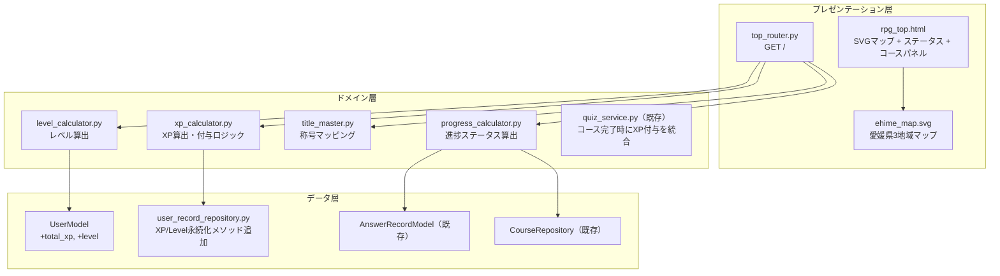
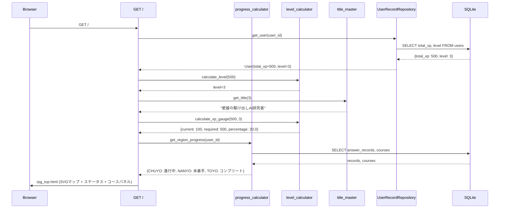
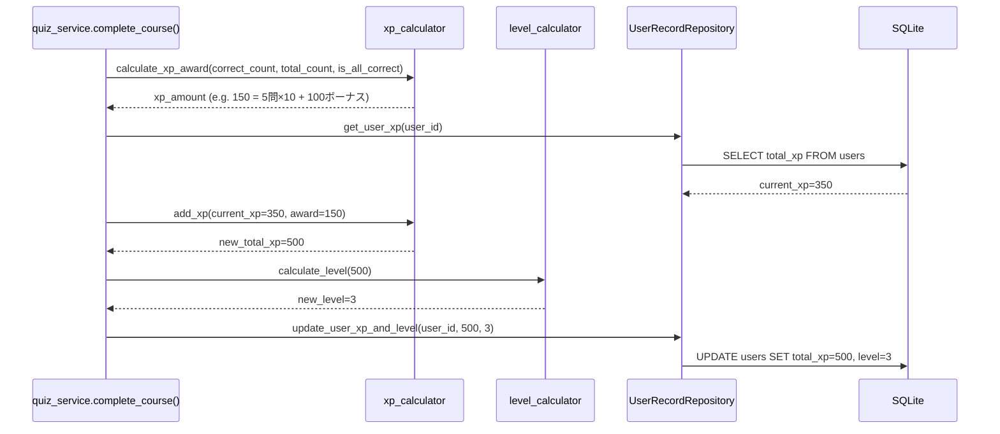

# Design Document: RPG風マップトップ画面

## Overview

既存の愛媛探索AIクイズのトップ画面（コース選択画面）を、RPG要素（経験値・レベル・称号）とインタラクティブSVGマップを統合した新しいトップ画面に刷新する。

既存のレイヤードアーキテクチャ（`app/data` → `app/domain` → `app/presentation`）を維持しつつ、以下の新規コンポーネントを追加する：

- **ドメイン層**: XP計算、レベル計算、称号マスタの3つの純粋関数モジュール
- **データ層**: UserModelへのtotal_xp / levelカラム追加
- **プレゼンテーション層**: SVGマップ + ステータスバー + コースパネルの統合テンプレート

設計方針：
- 既存の `scoring.py` パターンに倣い、新モジュールは副作用のない純粋関数群として実装する
- XP/レベル計算は数学的に決定的であり、プロパティベーステストによる検証が可能
- SVGマップはインラインSVGとしてJinja2テンプレートに埋め込み、JavaScript不要で初期描画を実現する
- HTMX（既存導入済み）を活用し、マップクリック時のコースパネル更新をサーバーサイドで処理する

## Architecture

### 全体レイヤー構成



### データフロー図



### XP付与フロー



## Components and Interfaces

### 1. xp_calculator.py（新規）

```python
"""XP算出モジュール - 純粋関数群"""

XP_PER_CORRECT_ANSWER: int = 10
PERFECT_COURSE_BONUS: int = 100


def calculate_xp_award(correct_count: int, total_count: int) -> int:
    """コース完了時のXP獲得量を算出する。
    
    Args:
        correct_count: 正解数
        total_count: 総問題数
    
    Returns:
        獲得XP（正解数×10 + パーフェクト時100ボーナス）
    """
    ...


def add_xp(current_xp: int, award: int) -> int:
    """現在のXPに獲得XPを加算する。
    
    Args:
        current_xp: 現在の累計XP（≥0）
        award: 獲得XP（≥0）
    
    Returns:
        新しい累計XP
    
    Raises:
        ValueError: current_xpまたはawardが負の場合
    """
    ...
```

### 2. level_calculator.py（新規）

```python
"""レベル算出モジュール - 純粋関数群"""

MAX_LEVEL: int = 99
MAX_XP: int = 980_100  # 99² × 100


def calculate_level(total_xp: int) -> int:
    """累計XPからレベルを算出する。
    
    Level N の必要XP = N² × 100
    Level 1: 0 XP, Level 2: 100 XP, Level 3: 400 XP, ...
    
    Args:
        total_xp: 累計XP（0以上の整数）
    
    Returns:
        レベル（1〜99）
    
    Raises:
        ValueError: total_xpが負の場合、または整数でない場合
    """
    ...


def xp_threshold_for_level(level: int) -> int:
    """指定レベルに必要な累計XPしきい値を返す。
    
    Args:
        level: レベル（1以上の整数）
    
    Returns:
        必要累計XP（level² × 100）
    
    Raises:
        ValueError: levelが1未満または整数でない場合
    """
    ...


def calculate_xp_gauge(total_xp: int, level: int) -> dict:
    """XPゲージ表示用データを算出する。
    
    Args:
        total_xp: 現在の累計XP
        level: 現在のレベル
    
    Returns:
        {"current_level_xp": int, "required_xp": int, "percentage": float}
        - current_level_xp: 現レベルから貯めたXP
        - required_xp: 次レベルまでの必要XP
        - percentage: 0.0〜100.0
    """
    ...
```

### 3. title_master.py（新規）

```python
"""称号マスタモジュール - 純粋関数群"""

TITLE_MAPPING: list[tuple[range, str]] = [
    (range(1, 3), "伊予の迷い人"),           # Level 1-2
    (range(3, 6), "愛媛の駆け出しAI研究者"),  # Level 3-5
    (range(6, 10), "道後を極めしAIエンジニア"), # Level 6-9
    # Level 10+ は特殊処理
]
MAX_TITLE: str = "伝説の愛媛AIマスター"


def get_title(level: int) -> str:
    """レベルに対応する称号を返す。
    
    Args:
        level: 現在のレベル（1以上の整数）
    
    Returns:
        称号文字列
    
    Raises:
        ValueError: levelが1未満または整数でない場合
    """
    ...
```

### 4. progress_calculator.py（新規）

```python
"""進捗ステータス算出モジュール"""

from enum import Enum
from app.domain.models import Region


class ProgressStatus(str, Enum):
    NOT_STARTED = "未着手"
    IN_PROGRESS = "進行中"
    COMPLETE = "コンプリート"


def calculate_region_progress(
    region: Region,
    courses_in_region: list[str],  # course_ids
    user_answer_records: list,      # AnswerRecord for this user
    course_questions: dict[str, list[str]],  # {course_id: [question_ids]}
) -> ProgressStatus:
    """地域の進捗ステータスを算出する。
    
    - 未着手: エリア内コースに回答記録なし
    - 進行中: 一部コースに回答記録あるが全コース完了していない
    - コンプリート: 全コースで全問正解セッションが存在する
    
    Args:
        region: 対象地域
        courses_in_region: その地域のコースIDリスト
        user_answer_records: ユーザーの回答記録
        course_questions: コースごとの問題IDリスト
    
    Returns:
        ProgressStatus enum
    """
    ...
```

### 5. top_router.py（新規）

```python
"""RPGトップ画面ルーター"""

from fastapi import APIRouter, Depends, Request
from fastapi.responses import HTMLResponse
from fastapi.templating import Jinja2Templates

router = APIRouter()
templates = Jinja2Templates(directory="app/templates")


@router.get("/", response_class=HTMLResponse)
async def rpg_top_screen(request: Request, ...):
    """RPG風トップ画面を表示する。
    
    ステータス表示、SVGマップ、コースパネルを統合して返す。
    """
    ...


@router.get("/courses/{region}", response_class=HTMLResponse)
async def get_region_courses(request: Request, region: str, ...):
    """HTMX用: 指定地域のコースパネルHTMLフラグメントを返す。
    
    マップクリック時にHTMXがこのエンドポイントを呼び出し、
    コースパネル部分のみを差し替える。
    """
    ...
```

### 6. SVGマップコンポーネント

SVGは `app/static/svg/ehime_map.svg` に配置し、テンプレートからインクルードする。

```svg
<!-- 構造概要 -->
<svg viewBox="0 0 600 400" xmlns="http://www.w3.org/2000/svg"
     role="img" aria-label="愛媛県地図">
  <g id="map-region-CHUYO" class="map-area" tabindex="0"
     role="button" aria-label="中予エリア">
    <path d="..." />
    <text>中予</text>
  </g>
  <g id="map-region-NANYO" class="map-area" tabindex="0"
     role="button" aria-label="南予エリア">
    <path d="..." />
    <text>南予</text>
  </g>
  <g id="map-region-TOYO" class="map-area" tabindex="0"
     role="button" aria-label="東予エリア">
    <path d="..." />
    <text>東予</text>
  </g>
</svg>
```

## Data Models

### UserModelスキーマ変更

既存の `UserModel` に2カラムを追加する：

```python
class UserModel(Base):
    __tablename__ = "users"

    id: Mapped[str] = mapped_column(String(64), primary_key=True)
    display_name: Mapped[str] = mapped_column(String(200), nullable=False)
    created_at: Mapped[datetime] = mapped_column(DateTime, nullable=False, server_default=func.now())
    
    # --- 新規追加 ---
    total_xp: Mapped[int] = mapped_column(Integer, nullable=False, server_default=text("0"))
    level: Mapped[int] = mapped_column(Integer, nullable=False, server_default=text("1"))
```

### ドメインモデル追加

```python
# app/domain/models.py に追加

@dataclass
class UserStatus:
    """RPGステータス表示用データ"""
    display_name: str
    level: int
    title: str
    total_xp: int
    xp_gauge_percentage: float  # 0.0〜100.0
    current_level_xp: int       # 現レベルから貯めたXP
    required_xp: int            # 次レベルまでの必要XP


@dataclass
class RegionMapData:
    """マップ描画用地域データ"""
    region: Region
    progress_status: str  # "未着手" | "進行中" | "コンプリート"
    fill_color: str       # CSS色コード
    courses: list[CourseInfo]
```

### マイグレーション

SQLiteのため `ALTER TABLE` で対応：

```sql
ALTER TABLE users ADD COLUMN total_xp INTEGER NOT NULL DEFAULT 0;
ALTER TABLE users ADD COLUMN level INTEGER NOT NULL DEFAULT 1;
```

既存ユーザーはデフォルト値（XP=0, Level=1）で初期化される。


## Correctness Properties

*A property is a characteristic or behavior that should hold true across all valid executions of a system—essentially, a formal statement about what the system should do. Properties serve as the bridge between human-readable specifications and machine-verifiable correctness guarantees.*

### Property 1: XP計算の正確性

*For any* non-negative integer `correct_count` and non-negative integer `total_count` where `correct_count ≤ total_count`, the XP award SHALL equal `correct_count × 10` when `correct_count < total_count`, and `correct_count × 10 + 100` when `correct_count == total_count` and `total_count > 0`.

**Validates: Requirements 2.1, 2.2, 2.3**

### Property 2: XP非負不変量

*For any* non-negative integer `current_xp` and non-negative integer `award`, `add_xp(current_xp, award)` SHALL return a value ≥ 0 and equal to `current_xp + award`.

**Validates: Requirements 2.6**

### Property 3: レベル計算ラウンドトリップ

*For any* integer `xp` in the range [0, 980100], computing `level = calculate_level(xp)` and then computing thresholds SHALL satisfy `xp_threshold_for_level(level) ≤ xp < xp_threshold_for_level(level + 1)` (where level+1 threshold is treated as infinity for level 99).

**Validates: Requirements 3.1, 3.2, 3.3**

### Property 4: レベル計算入力バリデーション

*For any* value that is either negative or non-integer, `calculate_level(value)` SHALL raise a `ValueError`.

**Validates: Requirements 3.4**

### Property 5: 称号マッピングの全射性と正確性

*For any* integer `level` where `level ≥ 1`, `get_title(level)` SHALL return exactly one string matching the specified mapping: "伊予の迷い人" for levels 1-2, "愛媛の駆け出しAI研究者" for levels 3-5, "道後を極めしAIエンジニア" for levels 6-9, "伝説の愛媛AIマスター" for levels 10+.

**Validates: Requirements 4.1, 4.3**

### Property 6: 称号マスタ入力バリデーション

*For any* value that is less than 1 or is not an integer, `get_title(value)` SHALL raise a `ValueError`.

**Validates: Requirements 4.4**

### Property 7: XPゲージの範囲と計算式正確性

*For any* valid `total_xp` (0 to 980100) and its corresponding `level`, `calculate_xp_gauge(total_xp, level)` SHALL return a percentage in the range [0.0, 100.0], computed as `(total_xp - threshold(level)) / (threshold(level+1) - threshold(level)) × 100` (100.0 for max level).

**Validates: Requirements 1.2, 1.3, 1.5**

### Property 8: 進捗ステータスの決定性

*For any* region with a list of courses, a set of user answer records, and course-question mappings, `calculate_region_progress()` SHALL return: "未着手" if no courses have any answer records, "コンプリート" if all courses have at least one session with all questions answered correctly (or the region has zero courses), and "進行中" otherwise.

**Validates: Requirements 7.2, 7.4**

### Property 9: XP/レベル整合性不変量

*For any* `total_xp` value persisted in the database, the corresponding `level` value SHALL always satisfy `xp_threshold_for_level(level) ≤ total_xp < xp_threshold_for_level(level + 1)`.

**Validates: Requirements 9.5**

## Error Handling

### XP/レベル計算エラー

| エラー条件 | 処理 | ユーザー表示 |
|---|---|---|
| `total_xp` が負の値 | `ValueError` 送出 | Level 1, 0 XP, "伊予の迷い人" をフォールバック表示 |
| `level` が1未満 | `ValueError` 送出 | Level 1, 0 XP, "伊予の迷い人" をフォールバック表示 |
| DB null/不正データ | フォールバック値適用 | Level 1, 0 XP, "伊予の迷い人" 表示 |
| XP永続化失敗 | エラーメッセージ表示、XP値はメモリ保持 | 「経験値の保存に失敗しました」メッセージ |

### マップ描画エラー

| エラー条件 | 処理 | ユーザー表示 |
|---|---|---|
| SVG読み込み失敗 | フォールバックHTML生成 | テキストリンクによるエリア選択UI |
| コースデータ取得失敗 | HTTPException(500) | 汎用エラーページ |
| 地域にコースなし | 正常処理（「準備中」表示） | 「コースは現在準備中です」メッセージ |

### プレゼンテーション層でのフォールバック

```python
def safe_get_user_status(user_id: str, db: Session) -> UserStatus:
    """ユーザーステータスを安全に取得する。DB異常時はデフォルト値を返す。"""
    try:
        user = get_user(user_id, db)
        total_xp = user.total_xp if user.total_xp is not None and user.total_xp >= 0 else 0
        level = calculate_level(total_xp)
        title = get_title(level)
        gauge = calculate_xp_gauge(total_xp, level)
        return UserStatus(
            display_name=user.display_name[:20] + ("…" if len(user.display_name) > 20 else ""),
            level=level,
            title=title,
            total_xp=total_xp,
            xp_gauge_percentage=gauge["percentage"],
            current_level_xp=gauge["current_level_xp"],
            required_xp=gauge["required_xp"],
        )
    except Exception:
        return UserStatus(
            display_name="ゲスト",
            level=1,
            title="伊予の迷い人",
            total_xp=0,
            xp_gauge_percentage=0.0,
            current_level_xp=0,
            required_xp=100,
        )
```

## Testing Strategy

### プロパティベーステスト（Hypothesis）

本機能のコアロジック（XP計算、レベル計算、称号マッピング、進捗判定）は純粋関数であり、プロパティベーステストに最適である。

**ライブラリ**: `hypothesis` (既にプロジェクトのdev依存に含まれている)

**設定**:
- 最小100イテレーション（`@settings(max_examples=100)` 以上）
- 各テストにはデザインプロパティへの参照コメントを付与
- タグ形式: `# Feature: ehime-rpg-map-topscreen, Property {N}: {property_text}`

**対象プロパティ**:
1. XP計算の正確性（Property 1）
2. XP非負不変量（Property 2）
3. レベル計算ラウンドトリップ（Property 3）
4. レベル計算入力バリデーション（Property 4）
5. 称号マッピングの全射性と正確性（Property 5）
6. 称号マスタ入力バリデーション（Property 6）
7. XPゲージの範囲と計算式正確性（Property 7）
8. 進捗ステータスの決定性（Property 8）
9. XP/レベル整合性不変量（Property 9）

### ユニットテスト（pytest）

プロパティテストを補完する具体例テスト：

- XP計算: 0問正解、1問正解、全問正解（5問、10問）の具体例
- レベル計算: 境界値（XP=0→L1, XP=99→L1, XP=100→L2, XP=400→L3）
- 称号: 各レベル範囲境界（L1, L2, L3, L5, L6, L9, L10, L99）
- 進捗ステータス: 空コース地域、一部完了地域、全完了地域
- ゲージ計算: Level 1で50XP→50%, Level 2で200XP→33.3%
- エラーハンドリング: DB null, 負値, フォールバック動作

### 統合テスト

- GET `/` がRPGトップ画面を返すことの確認
- HTMX `/courses/{region}` が正しいコースフラグメントを返すことの確認
- クイズ完了後のXP更新→トップ画面反映フロー
- マイグレーション後の既存ユーザーデフォルト値確認

### フロントエンドテスト

- SVGマップの構造確認（3エリア、ユニークID、テキストラベル）
- キーボードナビゲーション動作
- タブ↔マップ連動
- レスポンシブ表示（320px〜1920px）
