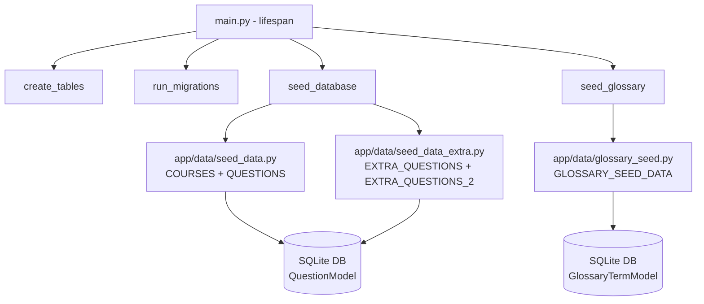

# Design Document: exam-ready-quiz-rebuild

## Overview

本設計書は、愛媛探索AIクイズアプリケーションのクイズ問題（300問以上）および用語集（150語以上）を全面的に再構築するためのデータ設計とファイル構成を定義する。

### 設計方針

- **既存アーキテクチャ維持**: QuestionModel / GlossaryTermModel / CourseModel のスキーマは一切変更しない
- **データのみの差し替え**: `app/data/seed_data.py`、`app/data/seed_data_extra.py`、`app/data/glossary_seed.py` のデータ定数を完全に置き換える
- **試験カバレッジ重視**: CLF-C02（4ドメイン）とAIF-C01（5ドメイン）の全出題範囲を体系的に網羅する
- **地域コンテキスト一貫性**: 南予→南予の地名、中予→中予の地名、東予→東予の地名を厳守する

### スコープ

| 対象 | 現状 | 目標 |
|------|------|------|
| クイズ問題数 | ~70問 | 300問以上（目標330問） |
| 用語集エントリ | ~55語 | 150語以上 |
| 試験ドメインカバレッジ | 部分的 | CLF-C02全4ドメイン + AIF-C01全5ドメイン完全網羅 |
| 難易度分布 | 不均一 | 南予=基礎(10ステージ), 中予=中級(8ステージ), 東予=上級(10ステージ) |

## Architecture

### システムアーキテクチャ（変更なし）

既存のアプリケーションアーキテクチャは維持される。本機能はデータ層のみの変更である。



### データファイル構成

問題数330問を以下のファイルに分割する（1ファイルあたり最大120問を目安）:

| ファイル | 内容 | 問題数目安 |
|----------|------|-----------|
| `app/data/seed_data.py` | COURSES (30件) + QUESTIONS (CLF-C02問題: ~110問) | ~110問 |
| `app/data/seed_data_extra.py` | EXTRA_QUESTIONS (CLF-C02残り + AIF-C01前半: ~110問) | ~110問 |
| `app/data/seed_data_extra2.py` | EXTRA_QUESTIONS_3 (AIF-C01後半: ~110問) | ~110問 |
| `app/data/glossary_seed.py` | GLOSSARY_SEED_DATA (150語以上) | - |

### 問題配分設計

#### CLF-C02 ドメイン配分（目標204問）

| ドメイン | 比率 | 目標問題数 | 基礎 | 中級 | 上級 |
|----------|------|-----------|------|------|------|
| Cloud Concepts | 24% | 49問 | 17 | 16 | 16 |
| Security and Compliance | 30% | 61問 | 21 | 20 | 20 |
| Cloud Technology and Services | 34% | 70問 | 24 | 23 | 23 |
| Billing Pricing and Support | 12% | 24問 | 8 | 8 | 8 |

#### AIF-C01 ドメイン配分（目標126問）

| ドメイン | 比率 | 目標問題数 | 基礎 | 中級 | 上級 |
|----------|------|-----------|------|------|------|
| AI and ML Fundamentals | 20% | 25問 | 9 | 8 | 8 |
| Generative AI Concepts | 24% | 30問 | 10 | 10 | 10 |
| Applications of Foundation Models | 28% | 35問 | 12 | 12 | 11 |
| Guidelines for Responsible AI | 14% | 18問 | 6 | 6 | 6 |
| Security Compliance and Governance for AI | 14% | 18問 | 6 | 6 | 6 |

#### コースへの問題割り当て（各コース10〜12問）

- 南予 (nanyo-stage-01〜10): 基礎問題、各ステージ10〜11問
- 中予 (chuyo-stage-01〜08): 中級問題、各ステージ12〜14問
- 東予 (toyo-stage-01〜10): 上級問題、各ステージ10〜11問

## Components and Interfaces

### 変更対象コンポーネント

#### 1. `app/data/seed_data.py`

```python
# 変更内容:
# - COURSES リスト: 30コース定義（変更なし）
# - QUESTIONS リスト: CLF-C02ドメインの問題（~110問）
# - seed_database() 関数: EXTRA_QUESTIONS + EXTRA_QUESTIONS_3 を統合して投入

from app.data.seed_data_extra import EXTRA_QUESTIONS
from app.data.seed_data_extra2 import EXTRA_QUESTIONS_3

def seed_database(db: Session) -> bool:
    """コースと問題の初期データを投入する（データが空の場合のみ）"""
    existing = db.query(CourseModel).count()
    if existing > 0:
        return False
    
    # コース登録
    for course_data in COURSES:
        db.add(CourseModel(**course_data))
    
    # 全問題を統合して登録
    all_questions = QUESTIONS + EXTRA_QUESTIONS + EXTRA_QUESTIONS_3
    for q_data in all_questions:
        db.add(QuestionModel(**q_data))
    
    db.commit()
    return True
```

#### 2. `app/data/seed_data_extra.py`

```python
# EXTRA_QUESTIONS: CLF-C02残り + AIF-C01前半問題 (~110問)
EXTRA_QUESTIONS: list[dict] = [...]
# EXTRA_QUESTIONS_2 は削除（後方互換不要）
```

#### 3. `app/data/seed_data_extra2.py`（新規作成）

```python
# EXTRA_QUESTIONS_3: AIF-C01後半問題 (~110問)
EXTRA_QUESTIONS_3: list[dict] = [...]
```

#### 4. `app/data/glossary_seed.py`

```python
# GLOSSARY_SEED_DATA: 150語以上の用語定義
# カテゴリ: 11カテゴリに再編
GLOSSARY_SEED_DATA: list[dict] = [...]

# seed_glossary() 関数: 差分投入ロジック（変更なし）
```

### ID命名規則

#### 問題ID

形式: `{region}-{domain-abbr}-{sequential-number}`

| リージョン | プレフィックス |
|-----------|--------------|
| 南予 | `nanyo` |
| 中予 | `chuyo` |
| 東予 | `toyo` |

| ドメイン | 略称 |
|----------|------|
| Cloud Concepts | `cc` |
| Security and Compliance | `sc` |
| Cloud Technology and Services | `ct` |
| Billing Pricing and Support | `bp` |
| AI and ML Fundamentals | `ai` |
| Generative AI Concepts | `ga` |
| Applications of Foundation Models | `fm` |
| Guidelines for Responsible AI | `ra` |
| Security Compliance and Governance for AI | `sg` |

例: `nanyo-cc-001`, `chuyo-sc-015`, `toyo-fm-008`

### 愛媛県地域情報マッピング

| 地域 | 主要地名・名所 |
|------|------------|
| 南予 | 宇和島城、八幡浜港、内子町並み、大洲城、愛南町、佐田岬、四国カルスト、西予ジオパーク |
| 中予 | 松山城、道後温泉、石鎚山、砥部焼、伊予鉄道、坊っちゃん列車、松山空港、東温市 |
| 東予 | しまなみ海道、今治タオル、新居浜太鼓祭り、別子銅山、西条うちぬき、四国中央市製紙業、来島海峡 |

## Data Models

### QuestionModel（既存・変更なし）

```python
class QuestionModel(Base):
    __tablename__ = "questions"
    
    id: Mapped[str] = mapped_column(String(64), primary_key=True)
    course_id: Mapped[str] = mapped_column(ForeignKey("courses.id"), nullable=False)
    text: Mapped[str] = mapped_column(Text, nullable=False)
    choice_1: Mapped[str] = mapped_column(Text, nullable=False)
    choice_2: Mapped[str] = mapped_column(Text, nullable=False)
    choice_3: Mapped[str] = mapped_column(Text, nullable=False)
    choice_4: Mapped[str] = mapped_column(Text, nullable=False)
    correct_choice_index: Mapped[int] = mapped_column(Integer, nullable=False)
    ehime_trivia: Mapped[str] = mapped_column(Text, nullable=False)
    aws_ai_explanation: Mapped[str] = mapped_column(Text, nullable=False)
    difficulty: Mapped[str] = mapped_column(String(20), nullable=False)
    exam_domain: Mapped[str] = mapped_column(String(100), nullable=False)
```

### GlossaryTermModel（既存・変更なし）

```python
class GlossaryTermModel(Base):
    __tablename__ = "glossary_terms"
    
    id: Mapped[str] = mapped_column(String(64), primary_key=True)
    category: Mapped[str] = mapped_column(String(100), nullable=False)
    term: Mapped[str] = mapped_column(String(200), nullable=False)
    description: Mapped[str] = mapped_column(Text, nullable=False)
    sort_order: Mapped[int] = mapped_column(Integer, nullable=False, default=0)
```

### CourseModel（既存・変更なし）

```python
class CourseModel(Base):
    __tablename__ = "courses"
    
    id: Mapped[str] = mapped_column(String(64), primary_key=True)
    name: Mapped[str] = mapped_column(String(200), nullable=False)
    region: Mapped[str] = mapped_column(String(20), nullable=False)
    difficulty: Mapped[str] = mapped_column(String(20), nullable=False)
    description: Mapped[str] = mapped_column(Text, nullable=False)
```

### データ制約（ビジネスルール）

| フィールド | 制約 |
|-----------|------|
| `id` | グローバル一意、形式: `{region}-{domain-abbr}-{NNN}` |
| `course_id` | COURSES リストの有効な id 値のみ |
| `correct_choice_index` | 0, 1, 2, 3 のいずれか |
| `difficulty` | "基礎", "中級", "上級" のいずれか |
| `exam_domain` | 9ドメインのいずれか |
| `text` | 非空、愛媛コンテキストを含む |
| `ehime_trivia` | 非空、愛媛県の事実情報 |
| `aws_ai_explanation` | 非空、正解の技術的解説 |
| `choice_1`〜`choice_4` | すべて非空、相互排他的 |

### 用語集カテゴリ構成

| カテゴリ名 | 想定用語数 | 対応試験 |
|-----------|-----------|---------|
| クラウド基礎 | 15語 | CLF-C02 |
| AWSコンピューティング | 12語 | CLF-C02 |
| AWSストレージ・データベース | 15語 | CLF-C02 |
| AWSネットワーキング | 10語 | CLF-C02 |
| AWSセキュリティ | 15語 | CLF-C02 |
| AWS管理・ガバナンス | 12語 | CLF-C02 |
| AWS料金・サポート | 10語 | CLF-C02 |
| AI・ML基礎 | 20語 | AIF-C01 |
| 生成AI・基盤モデル | 20語 | AIF-C01 |
| AWS AIサービス | 12語 | AIF-C01 |
| 責任あるAI | 10語 | AIF-C01 |


## Correctness Properties

*A property is a characteristic or behavior that should hold true across all valid executions of a system—essentially, a formal statement about what the system should do. Properties serve as the bridge between human-readable specifications and machine-verifiable correctness guarantees.*

### Property 1: Region-difficulty consistency

*For any* question in the seed data, if its course_id begins with "nanyo-" then difficulty must be "基礎", if it begins with "chuyo-" then difficulty must be "中級", and if it begins with "toyo-" then difficulty must be "上級".

**Validates: Requirements 1.2, 1.3, 1.4**

### Property 2: Question structural validity

*For any* question in the seed data, it must contain all required fields (id, course_id, text, choice_1, choice_2, choice_3, choice_4, correct_choice_index, ehime_trivia, aws_ai_explanation, difficulty, exam_domain), where all string fields are non-empty, correct_choice_index is an integer in {0, 1, 2, 3}, difficulty is one of {"基礎", "中級", "上級"}, and all four answer choices are distinct non-empty strings.

**Validates: Requirements 2.1, 2.4, 2.5, 3.2, 3.6, 7.4**

### Property 3: Question ID format validity

*For any* question in the seed data, its id must match the pattern `{region}-{domain-abbr}-{NNN}` where region is one of (nanyo, chuyo, toyo), domain-abbr is one of (cc, sc, ct, bp, ai, ga, fm, ra, sg), and NNN is a zero-padded three-digit number, ensuring global uniqueness across all questions.

**Validates: Requirements 2.2**

### Property 4: Question references valid course

*For any* question in the seed data, its course_id must be one of the 30 valid course IDs defined in the COURSES list (nanyo-stage-01 through nanyo-stage-10, chuyo-stage-01 through chuyo-stage-08, toyo-stage-01 through toyo-stage-10).

**Validates: Requirements 2.3**

### Property 5: Question has valid exam domain

*For any* question in the seed data, its exam_domain must be exactly one of the 9 recognized domain strings: "Cloud Concepts", "Security and Compliance", "Cloud Technology and Services", "Billing Pricing and Support", "AI and ML Fundamentals", "Generative AI Concepts", "Applications of Foundation Models", "Guidelines for Responsible AI", "Security Compliance and Governance for AI Solutions".

**Validates: Requirements 1.7**

### Property 6: Glossary entry structural validity

*For any* glossary entry in GLOSSARY_SEED_DATA, it must have a non-empty category from the set of 11 valid categories, a non-negative integer sort_order, a non-empty term string, and a description string of at least 20 characters.

**Validates: Requirements 6.2, 6.5, 6.6**

### Property 7: Glossary term uniqueness

*For any* two distinct glossary entries in GLOSSARY_SEED_DATA, their term values must be different (no duplicates across all categories).

**Validates: Requirements 6.7**

## Error Handling

### シードデータ投入時のエラーハンドリング

本機能はアプリケーション起動時のデータ投入に関わるため、以下のエラーケースを考慮する:

| エラーケース | 対処方針 |
|-------------|---------|
| 既存データがある場合 | `seed_database()` は既存コースが1件以上あればスキップ（変更なし） |
| 外部キー参照エラー | course_id が COURSES に存在しない場合、SQLAlchemy が IntegrityError を発生 → 起動失敗 |
| 重複ID | question.id が重複する場合、SQLAlchemy が IntegrityError を発生 → 起動失敗 |
| 用語集の差分投入失敗 | `seed_glossary()` は既存term名をチェックして新規のみ追加（変更なし） |

### データ品質エラーの防止策

- **静的バリデーション**: プロパティテストで全問題の構造的正当性を検証
- **ID一意性チェック**: プロパティテストでID重複を事前検出
- **外部キー整合性**: プロパティテストで course_id の有効性を事前検証
- **型安全性**: Python の型ヒントとテストで correct_choice_index の範囲を保証

### 既存データの完全置換手順

既存DBを新しいデータに完全置換する場合:

1. SQLiteファイル `ehime_quiz.db` を削除
2. アプリケーションを再起動
3. `lifespan` で `create_tables()` → `seed_database()` → `seed_glossary()` が実行
4. 新しいデータが投入される

## Testing Strategy

### テスト方針

本機能のテストは、**データの構造的正当性**に焦点を当てる。330問以上の問題と150語以上の用語集のすべてが制約を満たすことを保証するため、プロパティベーステスト（PBT）を中心に据える。

### プロパティベーステスト（Hypothesis）

プロジェクトで既に使用している **Hypothesis** ライブラリを使用する。

各プロパティテストは、データセットからランダムにサンプリングした問題/用語について制約が成り立つことを検証する。Hypothesisの `sampled_from` ストラテジーを活用し、全データに対して100回以上のイテレーションを実行する。

#### テストファイル構成

| ファイル | テスト内容 |
|---------|-----------|
| `tests/test_seed_data_properties.py` | Property 1〜5（問題データの構造的プロパティ） |
| `tests/test_glossary_properties.py` | Property 6〜7（用語集の構造的プロパティ） |
| `tests/test_seed_data_smoke.py` | カウント・分布のスモークテスト |

#### プロパティテスト構成

- 最低100イテレーション / プロパティテスト
- 各テストにデザインプロパティへの参照コメントを付与
- タグ形式: **Feature: exam-ready-quiz-rebuild, Property {number}: {property_text}**

```python
# 例: tests/test_seed_data_properties.py
from hypothesis import given, settings
from hypothesis.strategies import sampled_from

from app.data.seed_data import QUESTIONS
from app.data.seed_data_extra import EXTRA_QUESTIONS
from app.data.seed_data_extra2 import EXTRA_QUESTIONS_3

ALL_QUESTIONS = QUESTIONS + EXTRA_QUESTIONS + EXTRA_QUESTIONS_3

@settings(max_examples=200)
@given(question=sampled_from(ALL_QUESTIONS))
def test_region_difficulty_consistency(question):
    """Feature: exam-ready-quiz-rebuild, Property 1: Region-difficulty consistency"""
    if question["course_id"].startswith("nanyo-"):
        assert question["difficulty"] == "基礎"
    elif question["course_id"].startswith("chuyo-"):
        assert question["difficulty"] == "中級"
    elif question["course_id"].startswith("toyo-"):
        assert question["difficulty"] == "上級"
```

### ユニットテスト（スモークテスト）

| テスト | 検証内容 |
|--------|---------|
| `test_total_question_count` | 全問題数 >= 300 |
| `test_all_courses_have_questions` | 30コース全てに問題が存在 |
| `test_questions_per_course_range` | 各コース5〜15問 |
| `test_clp_domain_minimums` | CCP各ドメインの最低問題数 |
| `test_aif_domain_minimums` | AIF各ドメインの最低問題数 |
| `test_glossary_count` | 用語数 >= 150 |
| `test_courses_unchanged` | COURSES リストが30件で正しいID |

### テスト実行コマンド

```bash
# プロパティテストのみ実行
pytest tests/test_seed_data_properties.py tests/test_glossary_properties.py --run -v

# スモークテスト実行
pytest tests/test_seed_data_smoke.py --run -v

# 全テスト実行
pytest tests/ --run -v
```
