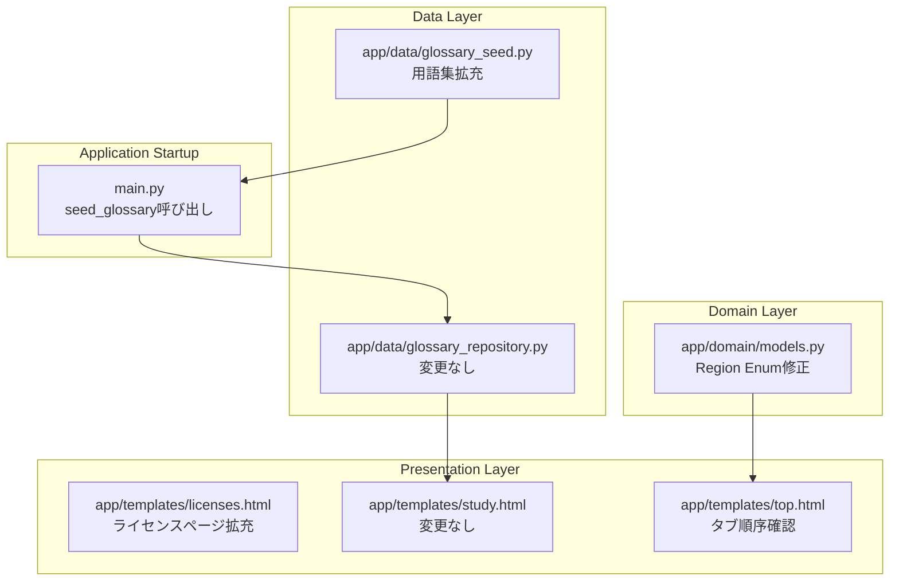

# Design Document: Glossary, License & Difficulty Enhancement

## Overview

本設計書は愛媛探索AIクイズアプリケーションに対する3つの改善を包括的に定義する。

1. **難易度と地域の対応関係修正**: `Region` Enumのメンバー順序と値を修正し、南予=初級、中予=中級、東予=上級の正しい対応関係を確立する。
2. **用語集の網羅的拡充**: `glossary_seed.py`に新たなカテゴリ・用語を追加し、クイズ問題に登場するすべての技術用語をカバーする。
3. **ライセンスページの拡充**: `licenses.html`に愛媛県オープンデータ、文化財データ、AWS公式ドキュメント、AI用語参考文献、AWS学習リソースの帰属情報セクションを追加する。

これら3つの変更は互いに独立しており、並行して実装可能である。

## Architecture



### 変更の影響範囲

| 変更対象 | ファイル | 影響 |
|---------|--------|------|
| Region Enum | `app/domain/models.py` | Enum値の変更、メンバー順序の変更 |
| 用語集シード | `app/data/glossary_seed.py` | データ追加のみ（既存構造は維持） |
| ライセンスページ | `app/templates/licenses.html` | HTMLセクション追加 |

### 既存データベースへの影響

- **Region Enum修正**: `courses`テーブルの`region`カラムにはEnum名（"NANYO"等）ではなく値（"初級"等）が格納されている。値の交換（TOYOの"中級"→"上級"、CHUYOの"上級"→"中級"）が必要なため、既存DBがある場合はマイグレーションスクリプトで対応する。
- **用語集拡充**: `seed_glossary()`は既存データがあればスキップする設計。新規用語を追加するには、既存データを削除するか、差分投入ロジックを追加する必要がある。

## Components and Interfaces

### 1. Region Enum（修正）

```python
# app/domain/models.py
class Region(str, Enum):
    """難易度による区分（マップ上の地域に対応）"""
    NANYO = "初級"    # 南予 - 初級
    CHUYO = "中級"    # 中予 - 中級
    TOYO = "上級"     # 東予 - 上級
```

**修正内容:**
- メンバー定義順序を `NANYO, CHUYO, TOYO` に変更（現在は `NANYO, TOYO, CHUYO`）
- TOYO の値を `"中級"` → `"上級"` に変更
- CHUYO の値を `"上級"` → `"中級"` に変更

### 2. Glossary Seed Data（拡充）

```python
# app/data/glossary_seed.py
GLOSSARY_SEED_DATA: list[dict] = [
    # 既存カテゴリの拡充
    # クラウド基礎: 追加用語（共有責任モデル、Well-Architected Framework、従量課金、リージョン、AZ、CDN、サーバーレス、マネージドサービス等）
    # AWSサービス: 追加用語（DynamoDB, VPC, IAM, CloudFront, Route 53, SQS, CloudFormation, ELB, S3 Glacier, KMS等）
    # AI基礎: 追加用語（ファインチューニング、転移学習、教師あり学習、教師なし学習、強化学習等）
    # AWS AIサービス: 追加用語（既に含まれるものの確認）
    
    # 新規カテゴリ
    # セキュリティ: MFA、暗号化、IAMポリシー、セキュリティグループ、最小権限の原則
]
```

**インターフェース:**
- 既存の `seed_glossary(db: Session) -> bool` 関数はそのまま利用
- `GlossaryRepository.get_all_grouped_by_category()` も変更不要（カテゴリ名でグルーピングするため自動的に新カテゴリも対応）

### 3. seed_glossary 関数の改善

現在の `seed_glossary()` は「データが1件でも存在すればスキップ」する設計。用語集拡充後に既存DBを更新するため、差分投入（upsert）ロジックを追加する。

```python
def seed_glossary(db: Session) -> bool:
    """用語集の初期データを投入する。
    
    既存データがある場合でも、GLOSSARY_SEED_DATAに含まれるが
    DBに存在しない用語を追加する（差分投入）。
    """
```

### 4. License Page Template（拡充）

新規セクション追加:

| セクション | 内容 |
|-----------|------|
| 愛媛県オープンデータ | CC BY 4.0、pref.ehime.jp/opendata-catalog/ |
| 愛媛県文化財データ | ehimenotakara、bunkazai/shitei-itiran |
| AWS公式ドキュメント | 試験ガイド、サービスドキュメント、ホワイトペーパー |
| AI用語参考文献 | Stanford HAI、MIT Media Lab、Wikipedia |
| AWS学習リソース | AWS Skill Builder、Cloud Practitioner Essentials |

既存の2セクション（愛媛県地図データ、その他のライブラリ）は維持する。

## Data Models

### GlossaryTermModel（変更なし）

```python
class GlossaryTermModel(Base):
    __tablename__ = "glossary_terms"
    id: Mapped[str]           # UUID primary key
    category: Mapped[str]     # カテゴリ名（例: "クラウド基礎"）
    term: Mapped[str]         # 用語名
    description: Mapped[str]  # 説明文
    sort_order: Mapped[int]   # カテゴリ内の表示順
```

### 用語集カテゴリ構成（拡充後）

| カテゴリ | 既存数 | 追加予定数 | 合計目安 |
|---------|--------|-----------|---------|
| クラウド基礎 | 6 | ~8 | ~14 |
| AWSサービス | 4 | ~14 | ~18 |
| AI基礎 | 9 | ~5 | ~14 |
| AWS AIサービス | 4 | 0 | 4 |
| セキュリティ（新規） | 0 | ~5 | ~5 |

### Region Enum値とDBの整合性

`courses`テーブルの`region`カラムには現在以下の値が格納されている可能性がある:
- `"初級"` (NANYO) — 変更なし
- `"中級"` (TOYO → 正しくはCHUYO) — 要マイグレーション
- `"上級"` (CHUYO → 正しくはTOYO) — 要マイグレーション

マイグレーションの方針:
1. 既存DBの`courses`テーブルで`region="中級"`の行を一時的にマーキング
2. `region="上級"`の行を`"中級"`に変更
3. マーキングした行を`"上級"`に変更

ただし、シードデータ（`seed_data.py`）の方でcourse定義時にregion値を直接指定しているため、シードデータの修正も必要。新規DBでは正しいシードデータで投入されるため、マイグレーションは既存DB向けのみ必要。

## Correctness Properties

*A property is a characteristic or behavior that should hold true across all valid executions of a system — essentially, a formal statement about what the system should do. Properties serve as the bridge between human-readable specifications and machine-verifiable correctness guarantees.*

### Property 1: Region Enum iteration order matches difficulty progression

*For any* iteration over the `Region` enum, the sequence of values produced SHALL be `["初級", "中級", "上級"]` in that exact order, ensuring Python's enum iteration order reflects the intended difficulty progression from beginner to advanced.

**Validates: Requirements 1.3, 1.4**

### Property 2: Course difficulty label consistency

*For any* course with a given region assignment, the displayed difficulty label SHALL equal the `Region` enum value for that region — specifically, NANYO courses display "初級", CHUYO courses display "中級", and TOYO courses display "上級".

**Validates: Requirements 1.1, 1.5**

### Property 3: Glossary seed data structural integrity

*For any* entry in `GLOSSARY_SEED_DATA`, the entry SHALL contain non-empty values for all required keys: `"category"` (non-empty string), `"sort_order"` (non-negative integer), `"term"` (non-empty string), and `"description"` (non-empty string).

**Validates: Requirements 2.5**

### Property 4: Glossary sort_order sequential within category

*For any* category in `GLOSSARY_SEED_DATA`, the `sort_order` values for entries in that category SHALL form a contiguous sequence starting from 0 with no gaps or duplicates.

**Validates: Requirements 2.6**

### Property 5: License page attribution completeness

*For any* attribution section in the license page, the rendered HTML SHALL contain the source name, a license type or usage terms description, and at least one valid hyperlink (`<a>` element with `href` attribute).

**Validates: Requirements 3.7**

## Error Handling

### Region Enum修正

- **既存DBとの不整合**: マイグレーションスクリプトが既にTOYO/CHUYOの値を正しく交換する。マイグレーション済みフラグを使用し、二重適用を防止する。
- **テンプレートでのEnum参照**: テンプレート内でEnum値をハードコードしている箇所があれば、Enum参照に統一する。

### 用語集シード

- **既存データとの重複**: `seed_glossary()`の差分投入ロジックで、term名の重複チェック（`term`カラムで検索）を行い、既存の用語はスキップする。
- **カテゴリの不整合**: カテゴリ名はシードデータのリテラル文字列で管理。typoを防ぐためにテストで全カテゴリ名を検証する。

### ライセンスページ

- **リンク切れ**: 外部URLへのリンクは`target="_blank" rel="noopener"`で開く。リンク切れは本アプリの責任範囲外だが、既知のURLを使用する。
- **テンプレートエラー**: Jinja2テンプレートの構文エラーはアプリ起動時に検出される。

## Testing Strategy

### テストアプローチ

本機能は3つの独立した改善で構成されるため、テストも3グループに分ける。

#### 1. 難易度・地域対応テスト（Unit Tests）

- Region Enumの値が正しいことを検証（NANYO="初級", CHUYO="中級", TOYO="上級"）
- Region Enumの反復順序が `[NANYO, CHUYO, TOYO]` であることを検証
- コース表示時に正しい難易度ラベルが使用されることを検証

#### 2. 用語集データテスト（Unit Tests + Property Tests）

- 必須用語（AWS、クラウド、AI/ML、セキュリティ）がすべて存在することを検証
- **Property Test**: 全エントリの構造的整合性（必須フィールド存在、型チェック）
- **Property Test**: カテゴリ内sort_orderの連番性
- `seed_glossary()`の差分投入ロジックの動作確認

#### 3. ライセンスページテスト（Unit Tests + Property Tests）

- 各帰属情報セクションの存在を検証
- 既存セクションが残っていることを検証（回帰テスト）
- **Property Test**: 各セクションの構造的完全性（名前、ライセンス、リンク）
- `/licenses`エンドポイントの200レスポンス確認

### Property-Based Testing Configuration

- **ライブラリ**: Hypothesis（Python）
- **最小反復回数**: 100回
- **タグフォーマット**: `Feature: glossary-license-difficulty-enhancement, Property {N}: {description}`

Property-based testing は用語集データの構造検証に最も有効。各用語エントリをランダムにサンプリングして構造的不変条件を検証する。ライセンスページのセクション構造検証にも適用可能。

### テスト対象外

- 外部URLのリンク切れチェック（CI/CDの外部依存を避けるため）
- SVGマップのレイアウト位置（視覚的回帰テストの範疇）
- ブラウザ上でのアコーディオン動作（E2Eテストの範疇）
